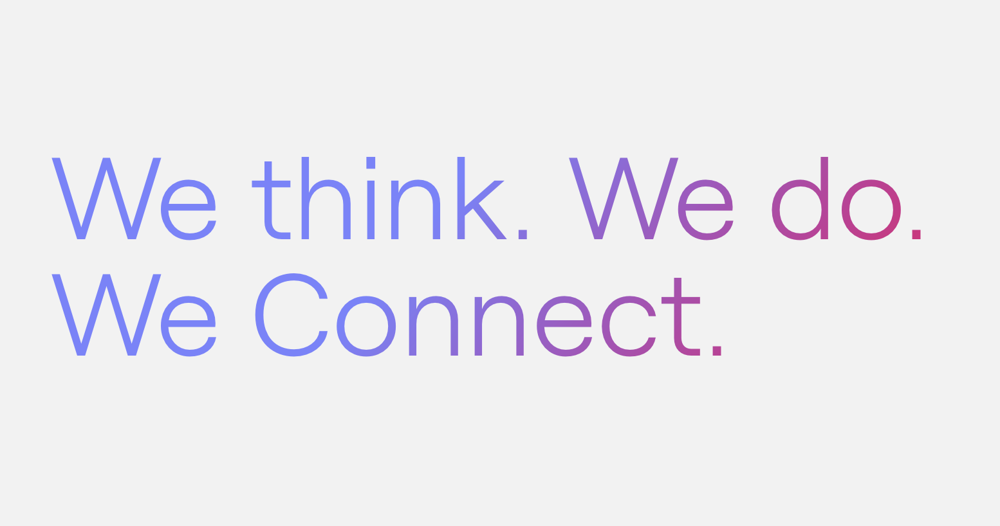

# NextJS Starter by Runroom
[](https://runroom.com)

[](https://github.com/Runroom/starter-next-js/actions/workflows/ci.yaml)

## Setting up your local repo
This starter uses **NPM** to manage dependencies and **Node version >= 20** to be executed. In order to clone and start it you can use this following commnads in your local machine:

```bash
git clone git@github.com:Runroom/starter-next-js.git
cd starter-next-js
npm install
```

This will leave everything ready to checkout your localhost starter site. To run your localhost environment you can use the following commands:

```bash
npm run build
```

After this command execution **you can access** `http://localhost:3000` with your browser and see the initial page.


## Local Development
When developing with this starter you can the following command to **enable a development environment** and **live reload** to see your code changes instantly affecting the frontend:

```bash
# Run a NextJS server and checkout http://localhost:3000/
npm run dev
# Run a test server with Mock Service Workers
npm run dev:test
```

You can start editing the page by modifying `app/page.tsx`. The page auto-updates as you edit the file.

## Local Development with Docker
We have created a basic Docker config to enable local development environment as well. You can see all options listed in `.docker/makefile` and run the following command to use it:

```bash
# Run a Docker server and checkout http://localhost:3000/
make
```

## Running tests
We have added this short commands to run unit and end to end testing than you can use:

```bash
# Run all Unit testing with Vitest
npm run test
# Run all End to End testing with Cypress
npm run e2e:dev:test
```

## Contribution
We are **happy to receive contributions** to this starter. If you want to contribute you can follow the next steps:

- Fork this repository
- Create your feature branch (`git checkout -b my-new-feature`)
- Commit your changes (`git commit -am 'Add some feature'`)
- Add changelog via `npx @changeset/cli`
- Push to the branch (`git push origin my-new-feature`)
- Create a new Pull Request

Also [we are keeping track of issues for this project here](https://github.com/Runroom/starter-next-js/issues), feel free to check them or **contribute and help us** with any of them.

## License

This starter is open-sourced software licensed under the [MIT license](https://opensource.org/licenses/MIT).


---
## Runroom ♥

[Runroom is a software development company](https://runroom.com) based in Barcelona. We are a team of passionate developers and designers that create memorable experiences for your customers.

### More open Source Projects made at Ruroom:
* [Stooa](https://github.com/Stooa): The free & open source fishbowl solution, where online unconference events happen.
